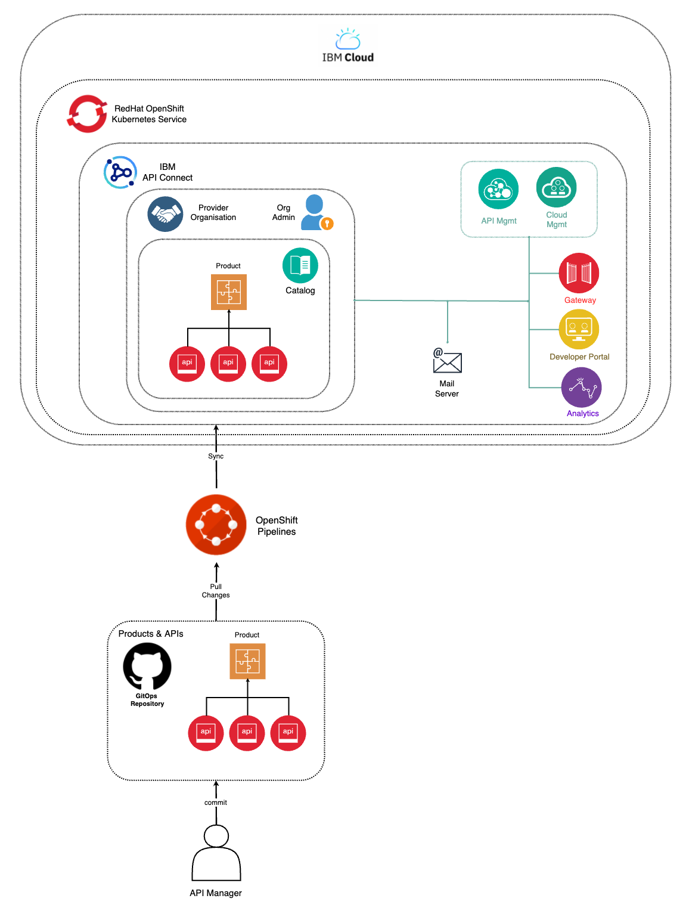

# API Connect Publish Pipeline

This GitHub repo stores your API Connect Publish Products and APIs Pipeline.

The aim of the work in this GitHub repo is to GitOps-fy Products and APIs components of IBM API Connect with a automation framework written primarily in Python that gets executed through an OpenShift Pipeline. The goal of the automation framework is to keep the declarations of your IBM API Connect Products and APIs that live in a GitHub repository in sync with the IBM API Connect Products and APIs that are published on your IBM API Connect instance's Catalog. Hence, simulating a GitOps-y approach. 

This automation framework tries to work around the limitations of IBM API Connect which, at this point in time, offers a great set of management API endpoints to manage the Products and APIs within your IBM API Connect instance. As such, the automation framework has been developed to do that sync process in an imperative way which comes with some tradeoffs, potential tailoring needed per use case, etc...

As of now, this automation framework is pretty primitive in the sense that the sync process consists of deleting all existing Products and APIs in your IBM API Connect instance's catalog and publish the Products and APIs declaratively specified in your GitHub repository used as the source of truth in this GitOps methodology so that what is in that GitHub repo and what is in your IBM API Connect instance's catalog remains in sync.

